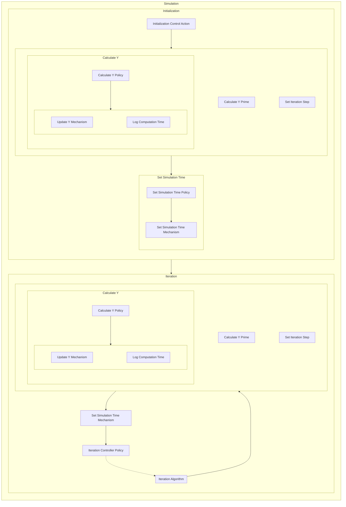

```mermaid
graph TB
subgraph X26[Simulation]
direction TB
subgraph X13[Initialization]
direction TB
X1[Initialization Control Action]
subgraph X9[ ]
direction LR
subgraph X6[Calculate Y]
direction TB
X2[Calculate Y Policy]
subgraph X5[ ]
direction LR
X3[Update Y Mechanism]
X4[Log Computation Time]
X3 ~~~ X4
end
X2-->X5
end
X7[Calculate Y Prime]
X8[Set Iteration Step]
X6 ~~~ X7
X7 ~~~ X8
end
subgraph X12[Set Simulation Time]
direction TB
X10[Set Simulation Time Policy]
X11[Set Simulation Time Mechanism]
X10-->X11
end
X1-->X9
X9-->X12
end
subgraph X25[Iteration]
direction TB
X14[Iteration Controller Policy]
subgraph X15[Iteration Algorithm]
direction TB
end
subgraph X23[ ]
direction LR
subgraph X20[Calculate Y]
direction TB
X16[Calculate Y Policy]
subgraph X19[ ]
direction LR
X17[Update Y Mechanism]
X18[Log Computation Time]
X17 ~~~ X18
end
X16-->X19
end
X21[Calculate Y Prime]
X22[Set Iteration Step]
X20 ~~~ X21
X21 ~~~ X22
end
X24[Set Simulation Time Mechanism]
X14-.->X15
X15-->X23
X23-->X24
end
X13-->X25
X24 --> X14
end
```