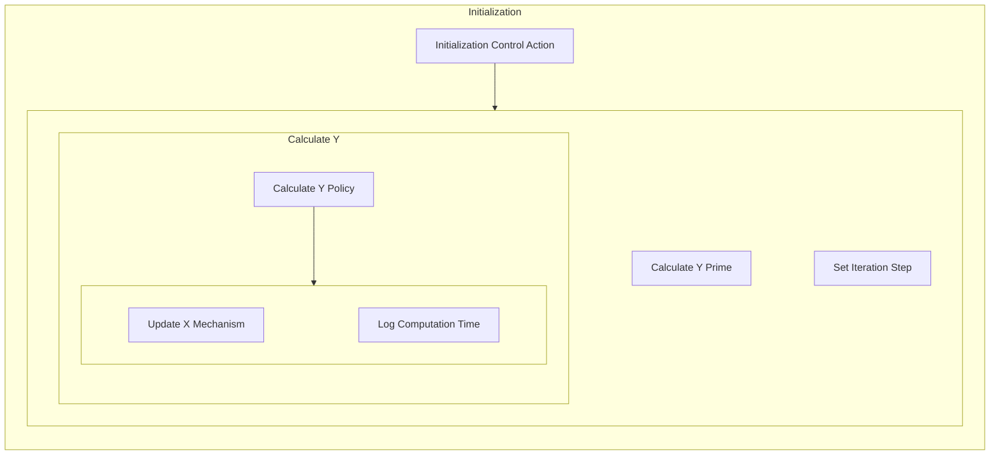

```mermaid
graph TB
subgraph X10[Initialization]
direction TB
X1[Initialization Control Action]
subgraph X9[ ]
direction LR
subgraph X6[Calculate Y]
direction TB
X2[Calculate Y Policy]
subgraph X5[ ]
direction LR
X3[Update X Mechanism]
X4[Log Computation Time]
X3 ~~~ X4
end
X2-->X5
end
X7[Calculate Y Prime]
X8[Set Iteration Step]
X6 ~~~ X7
X7 ~~~ X8
end
X1-->X9
end
```