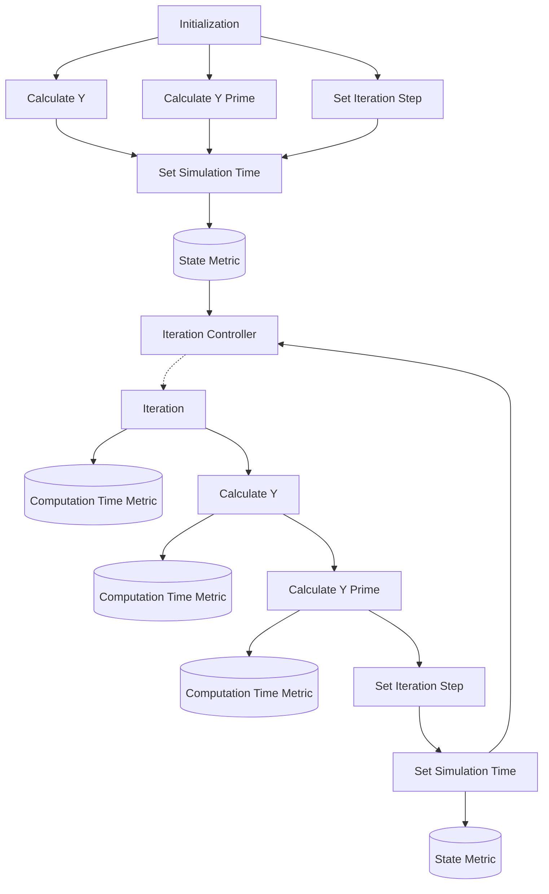

## System Diagram

## State

1. x: The current value for x, a scalar variable
2. y: The current value for y, the dependent variable, starts as None
3. y_prime: The current value for the derivative of y, starts as None
4. iteration_step: The value for the iteration which the algorithm is on, starts as 0
5. simulation_time: The current simulation time in datetime, assigned at simulation start

## Stateful Metrics
1. objective_value: The absolute value of y, which signifies the objective function we are trying to minimize to 0

## Parameters

### System

1. max_iterations: The maximum number of iterations that the algorithm is allowed to conduct
2. tolerance: The tolerance to determine if iteartions can stop

### Behavioral

None

### Functional

1. f: The function which is being minimized
2. f_prime: The derivative of the minimized function
3. root_finding_method: The root finding method utilized, which can be of the types:
- Bisection
- Newton
- Secant
- Steffensen

## Metrics

1. computation_time_metric: The metric for tracking of the amount of time for computation of different steps in the simulation, composed of:
- simulation_time: The time of the simulation at the end of computation
- computation_time: The amount of time a computation took
- action_name: The name of the action associated with the computation, i.e. calculate_f_prime or root_finding
2. state_metric: The metric for saving checkpoints of where the state is; holds all variables in the state at that point in time

## Blocks

### Initialization Block

The block which initializes the simulation and sets the simulation time/kicks off simulation

### State Metric Block

The block which records a state metric

### Iteration Controller Block

The block in charge of deciding if more iterations happen or if the simulation

### Calculate Y Block

The block for calculation of the y value

### Calculate Y Prime Block

The block for calculation of the y prime value

### Set Iteration Step Block

Block for updating the current iteration step

### Set Simulation Time Block

Block for updating the current simulation time

### Iteration Block

The block which modifies the x variable based on the root finding method
