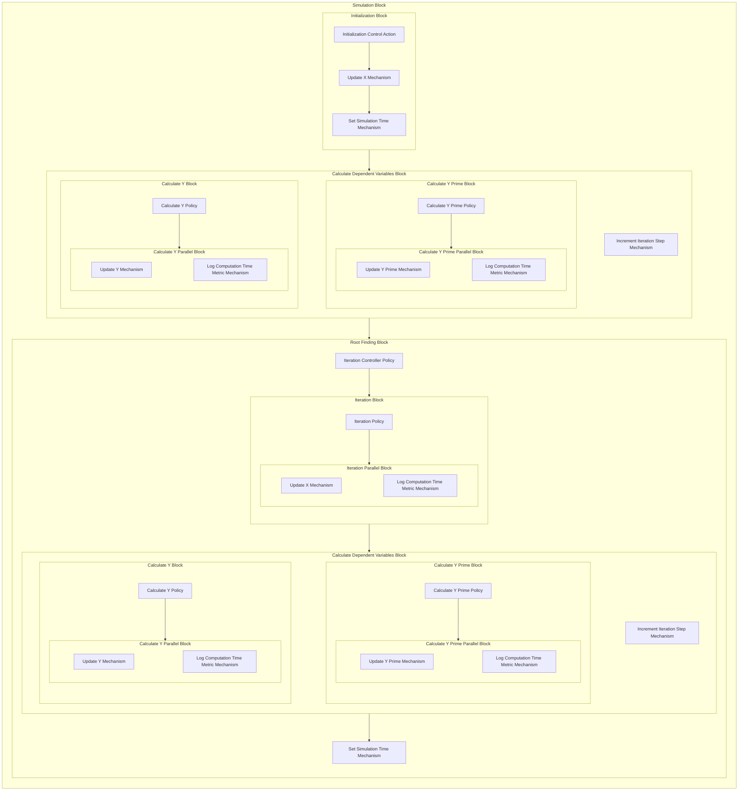

```mermaid
graph TB
subgraph X37[Simulation Block]
direction TB
subgraph X4[Initialization Block]
direction TB
X1[Initialization Control Action]
X2[Update X Mechanism]
X3[Set Simulation Time Mechanism]
X1-->X2
X2-->X3
end
subgraph X16[Calculate Dependent Variables Block]
direction LR
subgraph X9[Calculate Y Block]
direction TB
X5[Calculate Y Policy]
subgraph X8[Calculate Y Parallel Block]
direction LR
X6[Update Y Mechanism]
X7[Log Computation Time Metric Mechanism]
X6 ~~~ X7
end
X5-->X8
end
subgraph X14[Calculate Y Prime Block]
direction TB
X10[Calculate Y Prime Policy]
subgraph X13[Calculate Y Prime Parallel Block]
direction LR
X11[Update Y Prime Mechanism]
X12[Log Computation Time Metric Mechanism]
X11 ~~~ X12
end
X10-->X13
end
X15[Increment Iteration Step Mechanism]
X9 ~~~ X14
X14 ~~~ X15
end
subgraph X36[Root Finding Block]
direction TB
X17[Iteration Controller Policy]
subgraph X22[Iteration Block]
direction TB
X18[Iteration Policy]
subgraph X21[Iteration Parallel Block]
direction LR
X19[Update X Mechanism]
X20[Log Computation Time Metric Mechanism]
X19 ~~~ X20
end
X18-->X21
end
subgraph X34[Calculate Dependent Variables Block]
direction LR
subgraph X27[Calculate Y Block]
direction TB
X23[Calculate Y Policy]
subgraph X26[Calculate Y Parallel Block]
direction LR
X24[Update Y Mechanism]
X25[Log Computation Time Metric Mechanism]
X24 ~~~ X25
end
X23-->X26
end
subgraph X32[Calculate Y Prime Block]
direction TB
X28[Calculate Y Prime Policy]
subgraph X31[Calculate Y Prime Parallel Block]
direction LR
X29[Update Y Prime Mechanism]
X30[Log Computation Time Metric Mechanism]
X29 ~~~ X30
end
X28-->X31
end
X33[Increment Iteration Step Mechanism]
X27 ~~~ X32
X32 ~~~ X33
end
X35[Set Simulation Time Mechanism]
X17-->X22
X22-->X34
X34-->X35
end
X4-->X16
X16-->X36
end
```