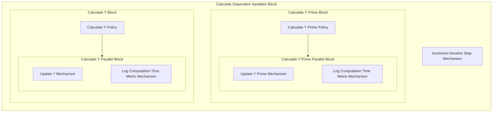

```mermaid
graph TB
subgraph X12[Calculate Dependent Variables Block]
direction LR
subgraph X5[Calculate Y Block]
direction TB
X1[Calculate Y Policy]
subgraph X4[Calculate Y Parallel Block]
direction LR
X2[Update Y Mechanism]
X3[Log Computation Time Metric Mechanism]
X2 ~~~ X3
end
X1-->X4
end
subgraph X10[Calculate Y Prime Block]
direction TB
X6[Calculate Y Prime Policy]
subgraph X9[Calculate Y Prime Parallel Block]
direction LR
X7[Update Y Prime Mechanism]
X8[Log Computation Time Metric Mechanism]
X7 ~~~ X8
end
X6-->X9
end
X11[Increment Iteration Step Mechanism]
X5 ~~~ X10
X10 ~~~ X11
end
```