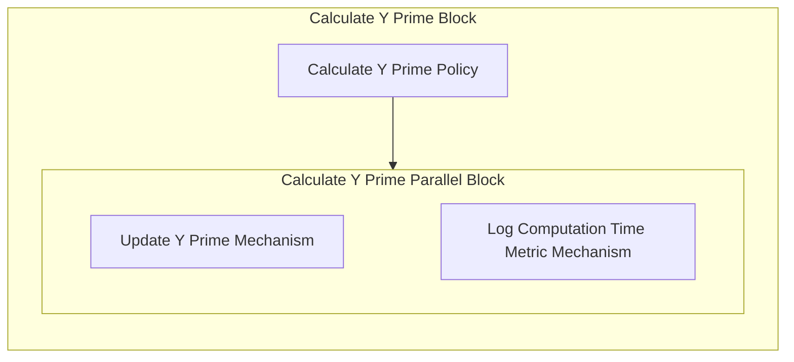

```mermaid
graph TB
subgraph X5[Calculate Y Prime Block]
direction TB
X1[Calculate Y Prime Policy]
subgraph X4[Calculate Y Prime Parallel Block]
direction LR
X2[Update Y Prime Mechanism]
X3[Log Computation Time Metric Mechanism]
X2 ~~~ X3
end
X1-->X4
end
```