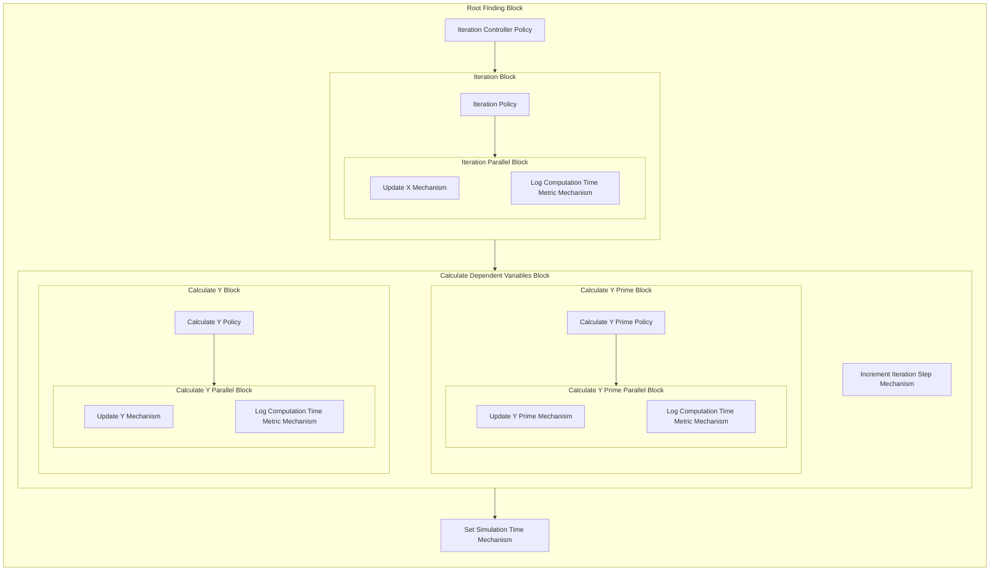

```mermaid
graph TB
subgraph X20[Root Finding Block]
direction TB
X1[Iteration Controller Policy]
subgraph X6[Iteration Block]
direction TB
X2[Iteration Policy]
subgraph X5[Iteration Parallel Block]
direction LR
X3[Update X Mechanism]
X4[Log Computation Time Metric Mechanism]
X3 ~~~ X4
end
X2-->X5
end
subgraph X18[Calculate Dependent Variables Block]
direction LR
subgraph X11[Calculate Y Block]
direction TB
X7[Calculate Y Policy]
subgraph X10[Calculate Y Parallel Block]
direction LR
X8[Update Y Mechanism]
X9[Log Computation Time Metric Mechanism]
X8 ~~~ X9
end
X7-->X10
end
subgraph X16[Calculate Y Prime Block]
direction TB
X12[Calculate Y Prime Policy]
subgraph X15[Calculate Y Prime Parallel Block]
direction LR
X13[Update Y Prime Mechanism]
X14[Log Computation Time Metric Mechanism]
X13 ~~~ X14
end
X12-->X15
end
X17[Increment Iteration Step Mechanism]
X11 ~~~ X16
X16 ~~~ X17
end
X19[Set Simulation Time Mechanism]
X1-->X6
X6-->X18
X18-->X19
end
```