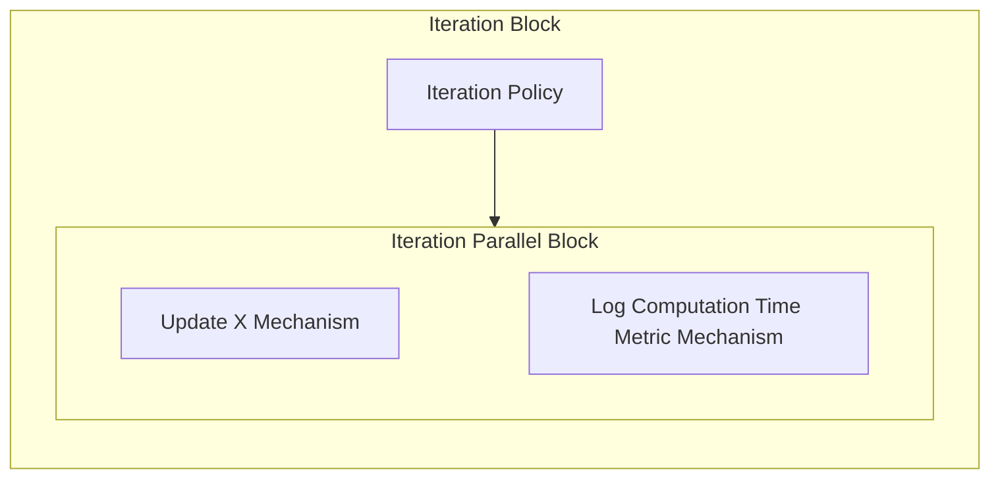

```mermaid
graph TB
subgraph X5[Iteration Block]
direction TB
X1[Iteration Policy]
subgraph X4[Iteration Parallel Block]
direction LR
X2[Update X Mechanism]
X3[Log Computation Time Metric Mechanism]
X2 ~~~ X3
end
X1-->X4
end
```