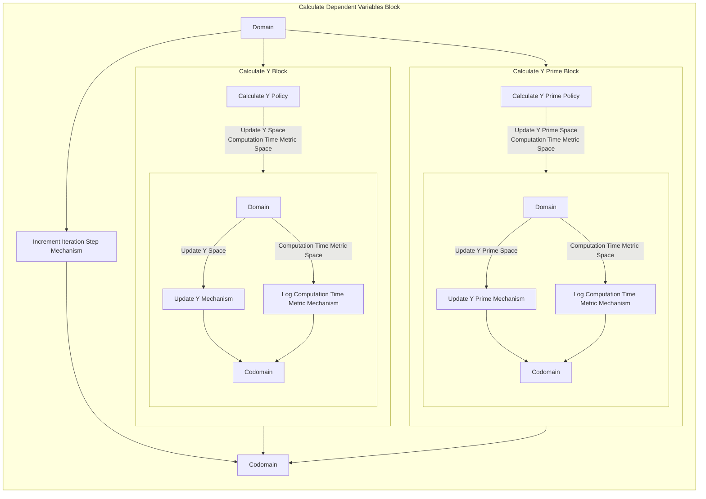

## Wiring Diagram

## Description

Block Type: Paralell Block
Block which updates the Y, Y Prime, and the iteration step.
## Components
1. [[Calculate Y Block]]
2. [[Calculate Y Prime Block]]
3. [[Increment Iteration Step Mechanism]]

## Constraints
## Domain Spaces
1. [[Empty Space]]

## Codomain Spaces
1. [[Empty Space]]

## Parameters Used
1. [[f_prime]]
2. [[f]]

## Called By

## Calls

