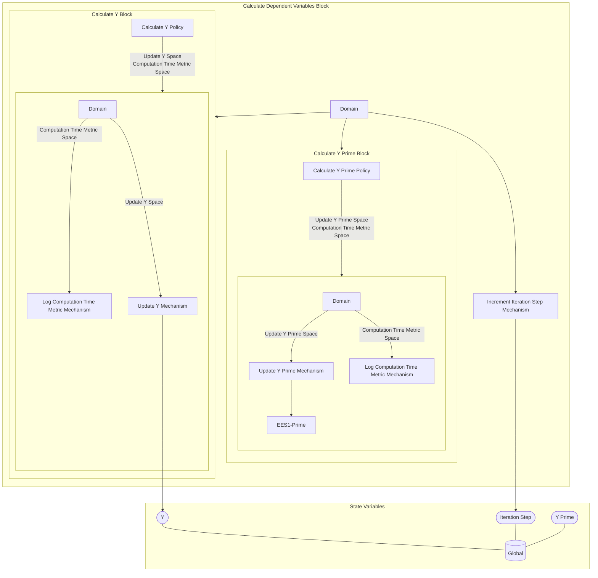

## Wiring Diagram

## Description

Block Type: Parallel Block
Block which updates the Y, Y Prime, and the iteration step.
## Components
1. [[Calculate Y Block]]
2. [[Calculate Y Prime Block]]
3. [[Increment Iteration Step Mechanism]]

## All Blocks
1. [[Update Y Prime Mechanism]]
2. [[Calculate Y Policy]]
3. [[Calculate Y Prime Policy]]
4. [[Log Computation Time Metric Mechanism]]
5. [[Update Y Mechanism]]
6. [[Increment Iteration Step Mechanism]]

## Constraints

## Domain Spaces
1. [[Empty Space]]

## Codomain Spaces
1. [[Empty Space]]

## All Spaces Used
1. [[Terminating Space]]
2. [[Empty Space]]
3. [[Computation Time Metric Space]]
4. [[Update Y Prime Space]]
5. [[Update Y Space]]

## Parameters Used
1. [[f]]
2. [[f_prime]]

## Called By

## Calls

## All State Updates
1. [[Global]].Iteration Step
2. [[Global]].Y
3. [[Global]].Y Prime

