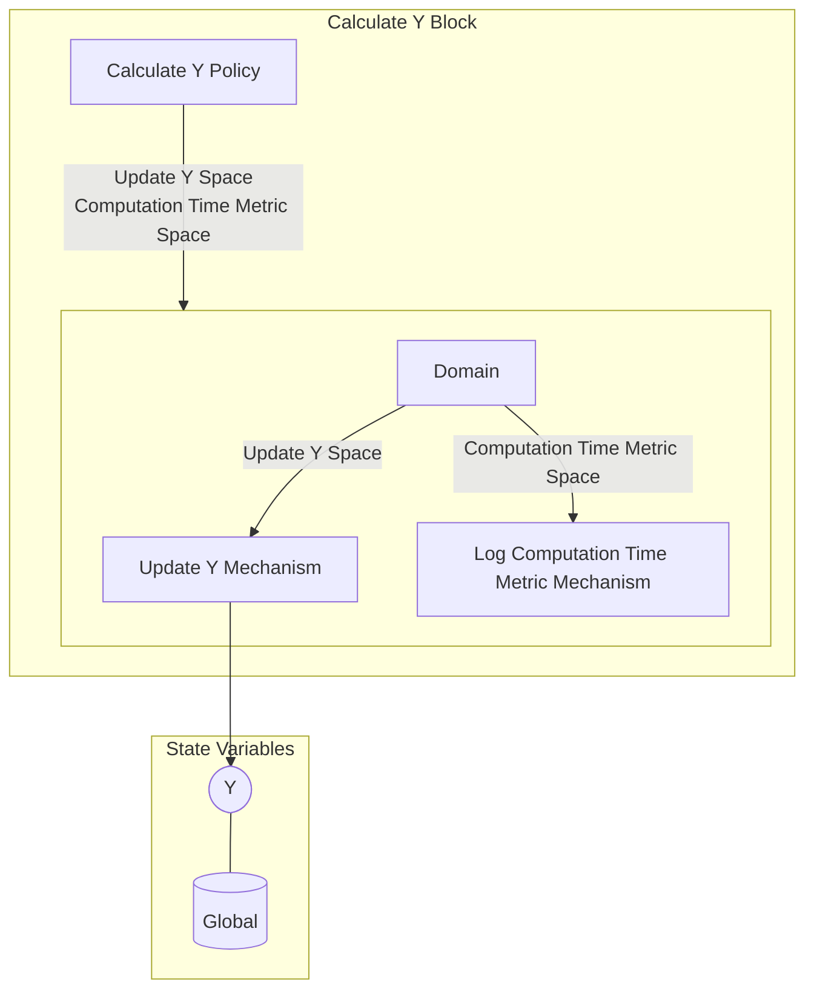

## Wiring Diagram

## Description

Block Type: Stack Block
Block which calculates and updates the Y value.
## Components
1. [[Calculate Y Policy]]
2. [[Calculate Y Parallel Block]]

## All Blocks
1. [[Log Computation Time Metric Mechanism]]
2. [[Calculate Y Policy]]
3. [[Update Y Mechanism]]

## Constraints

## Domain Spaces
1. [[Empty Space]]

## Codomain Spaces
1. [[Empty Space]]

## All Spaces Used
1. [[Empty Space]]
2. [[Computation Time Metric Space]]
3. [[Terminating Space]]
4. [[Update Y Space]]

## Parameters Used
1. [[f]]

## Called By

## Calls

## All State Updates
1. [[Global]].Y

