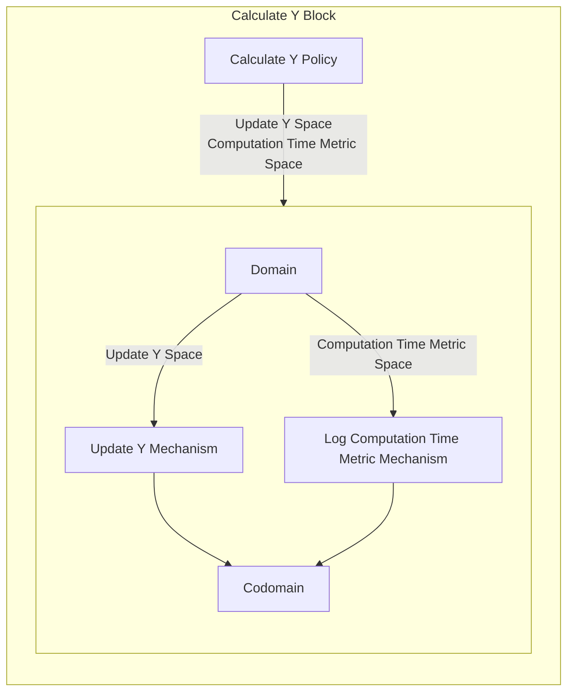

## Wiring Diagram

## Description

Block Type: Stack Block
Block which calculates and updates the Y value.
## Components
1. [[Calculate Y Policy]]
2. [[Calculate Y Parallel Block]]

## Constraints
## Domain Spaces
1. [[Empty Space]]

## Codomain Spaces
1. [[Empty Space]]

## Parameters Used
1. [[f]]

## Called By

## Calls

