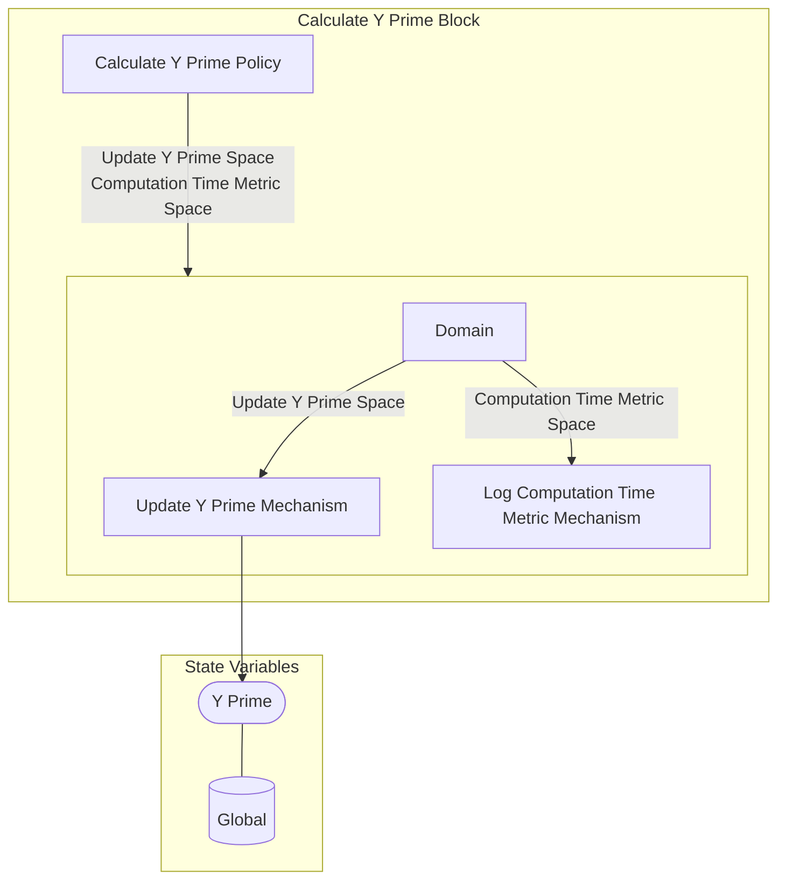

## Wiring Diagram

## Description

Block Type: Stack Block
Block which calculates and updates the Y prime value.
## Components
1. [[Calculate Y Prime Policy]]
2. [[Calculate Y Prime Parallel Block]]

## All Blocks
1. [[Log Computation Time Metric Mechanism]]
2. [[Update Y Prime Mechanism]]
3. [[Calculate Y Prime Policy]]

## Constraints

## Domain Spaces
1. [[Empty Space]]

## Codomain Spaces
1. [[Empty Space]]

## All Spaces Used
1. [[Update Y Prime Space]]
2. [[Empty Space]]
3. [[Computation Time Metric Space]]
4. [[Terminating Space]]

## Parameters Used
1. [[f_prime]]

## Called By

## Calls

## All State Updates
1. [[Global]].Y Prime

