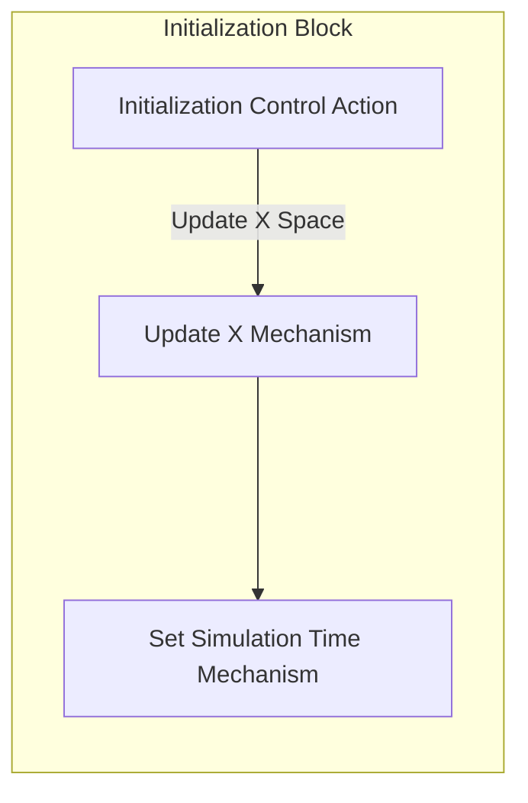

## Wiring Diagram

## Description

Block Type: Stack Block
Block which handles the initialization.
## Components
1. [[Initialization Control Action]]
2. [[Update X Mechanism]]
3. [[Set Simulation Time Mechanism]]

## Constraints
## Domain Spaces

## Codomain Spaces
1. [[Terminating Space]]

## Parameters Used

## Called By

## Calls

