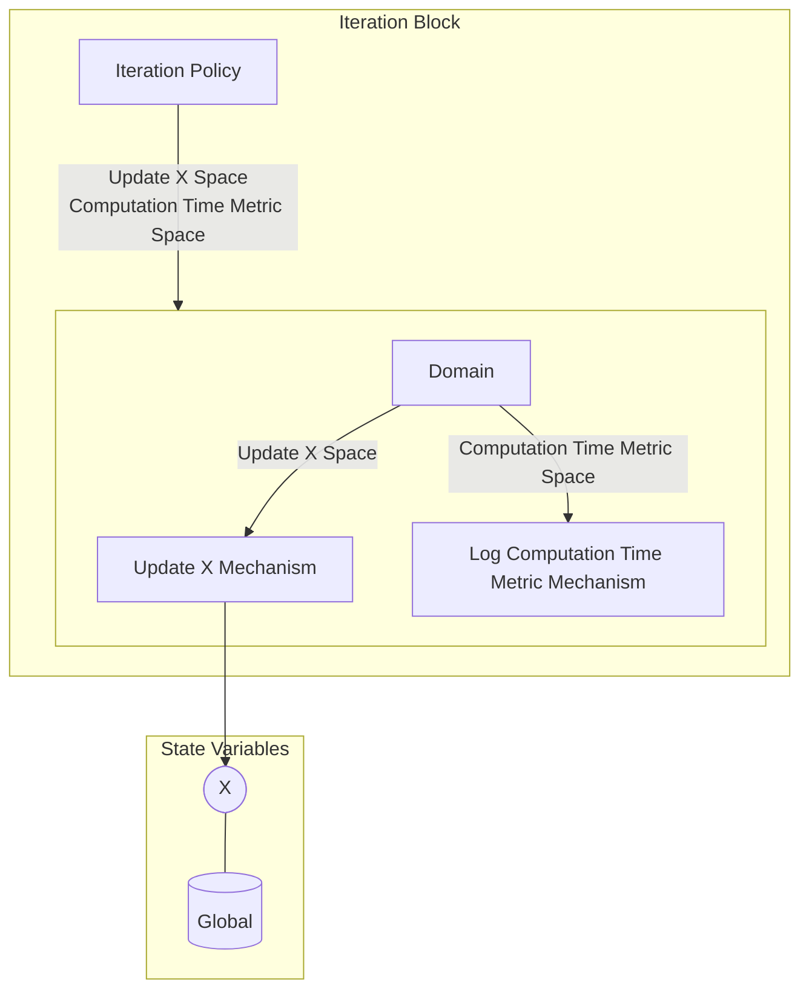

## Wiring Diagram

## Description

Block Type: Stack Block
Block which calculates one iteration.
## Components
1. [[Iteration Policy]]
2. [[Iteration Parallel Block]]

## All Blocks
1. [[Iteration Policy]]
2. [[Log Computation Time Metric Mechanism]]
3. [[Update X Mechanism]]

## Constraints

## Domain Spaces
1. [[Empty Space]]

## Codomain Spaces
1. [[Empty Space]]

## All Spaces Used
1. [[Computation Time Metric Space]]
2. [[Empty Space]]
3. [[Terminating Space]]
4. [[Update X Space]]

## Parameters Used
1. [[root_finding_method]]

## Called By

## Calls

## All State Updates
1. [[Global]].[[Global State-X|X]]

