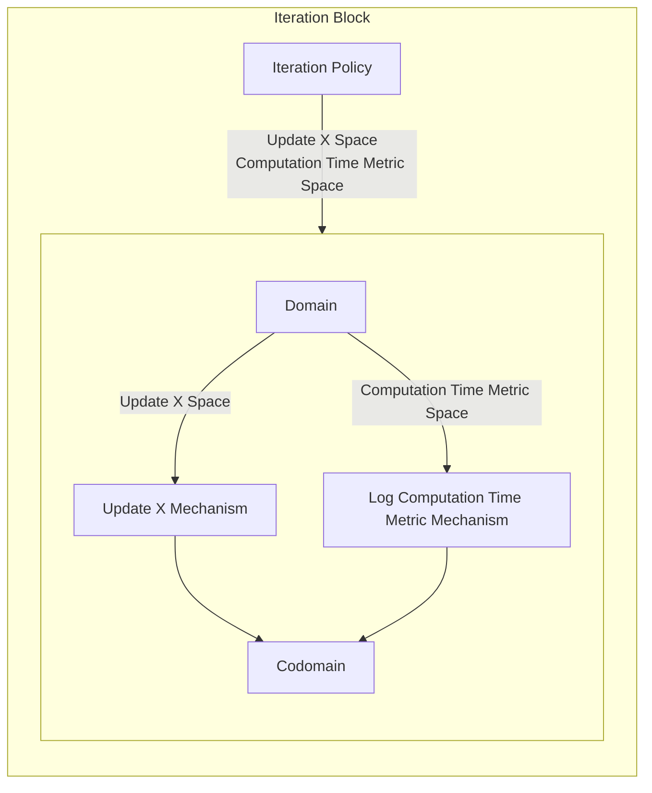

## Wiring Diagram

## Description

Block Type: Stack Block
Block which calculates one iteration.
## Components
1. [[Iteration Policy]]
2. [[Iteration Parallel Block]]

## Constraints
## Domain Spaces
1. [[Empty Space]]

## Codomain Spaces
1. [[Empty Space]]

## Parameters Used
1. [[root_finding_method]]

## Called By

## Calls

