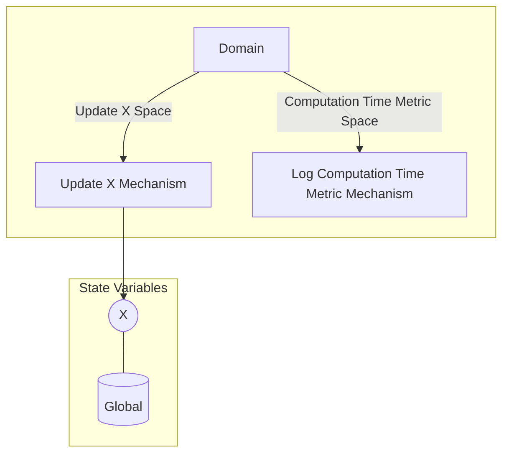

## Wiring Diagram

## Description

Block Type: Parallel Block
Block which updates X and logs the computation time taken.
## Components
1. [[Update X Mechanism]]
2. [[Log Computation Time Metric Mechanism]]

## All Blocks
1. [[Log Computation Time Metric Mechanism]]
2. [[Update X Mechanism]]

## Constraints

## Domain Spaces
1. [[Update X Space]]
2. [[Computation Time Metric Space]]

## Codomain Spaces
1. [[Empty Space]]

## All Spaces Used
1. [[Computation Time Metric Space]]
2. [[Empty Space]]
3. [[Terminating Space]]
4. [[Update X Space]]

## Parameters Used

## Called By

## Calls

## All State Updates
1. [[Global]].[[Global State-X|X]]

