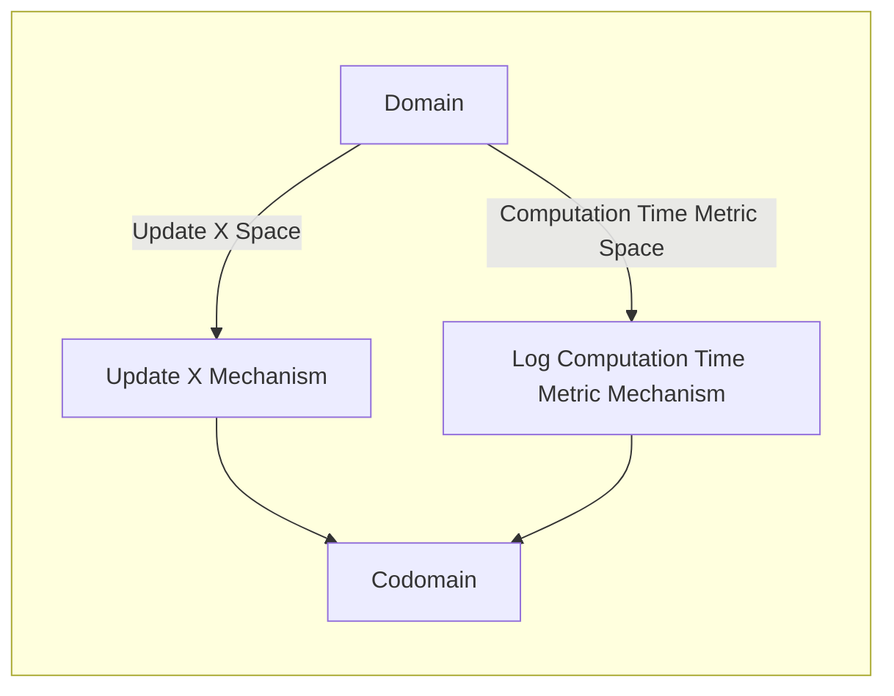

## Wiring Diagram

## Description

Block Type: Paralell Block
Block which updates X and logs the computation time taken.
## Components
1. [[Update X Mechanism]]
2. [[Log Computation Time Metric Mechanism]]

## Constraints
## Domain Spaces
1. [[Update X Space]]
2. [[Computation Time Metric Space]]

## Codomain Spaces
1. [[Empty Space]]

## Parameters Used

## Called By

## Calls

