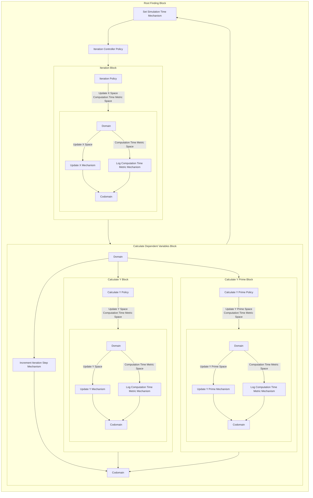

## Wiring Diagram

## Description

Block Type: Stack Block
Block which handles all aspects of using the root finding algorithm.
## Components
1. [[Iteration Controller Policy]]
2. [[Iteration Block]]
3. [[Calculate Dependent Variables Block]]
4. [[Set Simulation Time Mechanism]]

## Constraints
## Domain Spaces
1. [[Empty Space]]

## Codomain Spaces
1. [[Terminating Space]]

## Parameters Used
1. [[max_iterations]]
2. [[f]]
3. [[f_prime]]
4. [[root_finding_method]]

## Called By

## Calls

