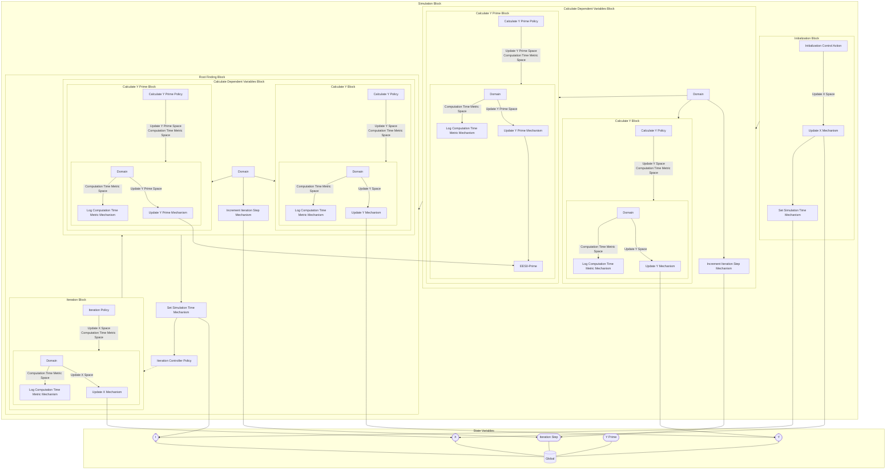

## Wiring Diagram

## Description

Block Type: Stack Block
Block which encapsulates the full simulation.
## Components
1. [[Initialization Block]]
2. [[Calculate Dependent Variables Block]]
3. [[Root Finding Block]]

## All Blocks
1. [[Update Y Mechanism]]
2. [[Log Computation Time Metric Mechanism]]
3. [[Update X Mechanism]]
4. [[Iteration Policy]]
5. [[Set Simulation Time Mechanism]]
6. [[Update Y Prime Mechanism]]
7. [[Initialization Control Action]]
8. [[Calculate Y Policy]]
9. [[Iteration Controller Policy]]
10. [[Calculate Y Prime Policy]]
11. [[Increment Iteration Step Mechanism]]

## Constraints

## Domain Spaces

## Codomain Spaces
1. [[Terminating Space]]

## All Spaces Used
1. [[Computation Time Metric Space]]
2. [[Terminating Space]]
3. [[Update X Space]]
4. [[Empty Space]]
5. [[Update Y Space]]
6. [[Update Y Prime Space]]

## Parameters Used
1. [[f]]
2. [[max_iterations]]
3. [[f_prime]]
4. [[root_finding_method]]

## Called By

## Calls

## All State Updates
1. [[Global]].Y
2. [[Global]].Iteration Step
3. [[Global]].X
4. [[Global]].Y Prime
5. [[Global]].t

