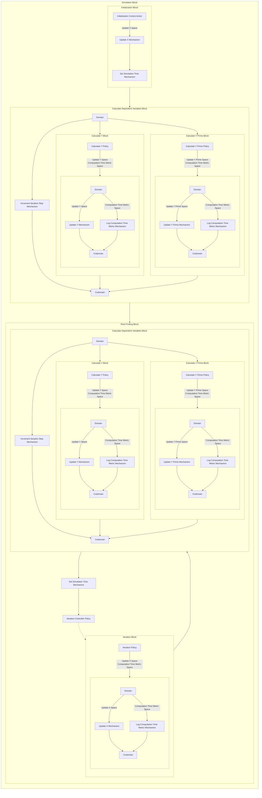

## Wiring Diagram

## Description

Block Type: Stack Block
Block which encapsulates the full simulation.
## Components
1. [[Initialization Block]]
2. [[Calculate Dependent Variables Block]]
3. [[Root Finding Block]]

## Constraints
## Domain Spaces

## Codomain Spaces
1. [[Terminating Space]]

## Parameters Used
1. [[f]]
2. [[f_prime]]
3. [[max_iterations]]
4. [[root_finding_method]]

## Called By

## Calls

