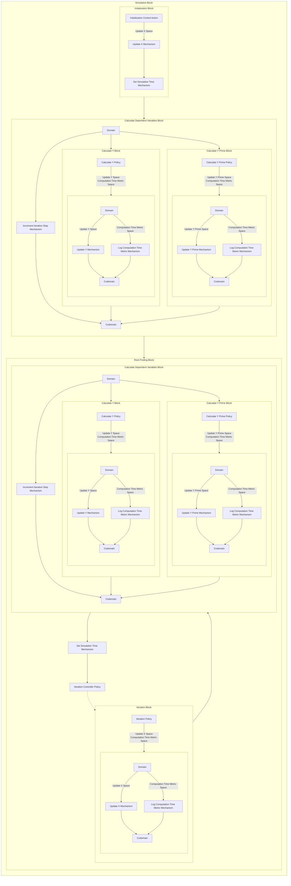

## Wiring Diagram

## State
<h3>Global State</h3><table>
      <tr>
        <th>Name</th>
        <th>Description</th>
        <th>Type</th>
        <th>Symbol</th>
        <th>Domain</th>
      </tr><tr><td>X</td><td></td><td>X Type</td><td></td><td></td></tr><tr><td>Iteration Step</td><td></td><td>Number of Iterations Type</td><td></td><td></td></tr><tr><td>t</td><td></td><td>Seconds Type</td><td></td><td></td></tr><tr><td>Y</td><td></td><td>Objective Value Type</td><td></td><td></td></tr><tr><td>Y Prime</td><td></td><td>Objective Derivative Value Type</td><td></td><td></td></tr></table><h3>Local States</h3><h2>Spaces</h2><h3>Update Y Prime Space</h3>
{y_prime: Objective Derivative Value Type}
<h3>Terminating Space</h3>
{}
<h3>Computation Time Metric Space</h3>
{simulation_time: Seconds Type, computation_time: Seconds Type, action_name: Action Name Type}
<h3>Empty Space</h3>
{}
<h3>Update X Space</h3>
{x: X Type}
<h3>Update Y Space</h3>
{y: Objective Value Type}
<h2>Behavioral Action Space</h2><h2>Control Action Space</h2><h3>Initialization Control Action</h3>
Control action to begin the simulation
<h4>Constraints:</h4>
<h2>Policies</h2><h3>Calculate Y Prime Policy</h3>
The policy which calculates the value for the derivative of f.
<h4>Preceded By:</h4>
<h4>Domain Spaces:</h4>

1. Empty Space
<h4>Followed By:</h4>

1. Update Y Prime Mechanism

2. Log Computation Time Metric Mechanism
<h4>Codomain Spaces:</h4>

1. Update Y Prime Space

2. Computation Time Metric Space
<h4>Constraints:</h4>
<h3>Calculate Y Policy</h3>
The policy which calculates the value for f.
<h4>Preceded By:</h4>
<h4>Domain Spaces:</h4>

1. Empty Space
<h4>Followed By:</h4>

1. Update Y Mechanism

2. Log Computation Time Metric Mechanism
<h4>Codomain Spaces:</h4>

1. Update Y Space

2. Computation Time Metric Space
<h4>Constraints:</h4>
<h3>Iteration Policy</h3>
The policy which produces one iteration of the root finding algorithm.
<h4>Preceded By:</h4>

1. Iteration Controller Policy
<h4>Domain Spaces:</h4>

1. Empty Space
<h4>Followed By:</h4>

1. Update X Mechanism

2. Log Computation Time Metric Mechanism
<h4>Codomain Spaces:</h4>

1. Update X Space

2. Computation Time Metric Space
<h4>Constraints:</h4>
<h3>Iteration Controller Policy</h3>
The policy which controls whether another iteration should take place in a simulation.
<h4>Preceded By:</h4>
<h4>Domain Spaces:</h4>

1. Empty Space
<h4>Followed By:</h4>

1. Iteration Policy
<h4>Codomain Spaces:</h4>

1. Empty Space
<h4>Constraints:</h4>
<h4>Policy Options:</h4>

<b>1. Constant Iterations Policy Option</b>

A policy option which runs a constant number of iterations for any simulation.

Logic: If state["iteration_step"] < params["max_iterations"], call the iteration policy, otherwise terminate

<b>2. Tolerance Policy Option</b>

A policy option which runs a constant number of iterations for any simulation unless abs(y) is less than a tolerance.

Logic: If state["iteration_step"] < params["max_iterations"] and abs(state["y"]) > params["tolerance"], call the iteration policy, otherwise terminate

 <h3>Calculate Y Prime Policy</h3>
The policy which calculates the value for the derivative of f.
<h4>Preceded By:</h4>
<h4>Domain Spaces:</h4>

1. Empty Space
<h4>Followed By:</h4>

1. Update Y Prime Mechanism

2. Log Computation Time Metric Mechanism
<h4>Codomain Spaces:</h4>

1. Update Y Prime Space

2. Computation Time Metric Space
<h4>Constraints:</h4>
<h3>Calculate Y Policy</h3>
The policy which calculates the value for f.
<h4>Preceded By:</h4>
<h4>Domain Spaces:</h4>

1. Empty Space
<h4>Followed By:</h4>

1. Update Y Mechanism

2. Log Computation Time Metric Mechanism
<h4>Codomain Spaces:</h4>

1. Update Y Space

2. Computation Time Metric Space
<h4>Constraints:</h4>
<h2>Mechanisms</h2><h3>Set Simulation Time Mechanism</h3>
Mechanism for setting the current time of the simulation
<h4>Preceded By:</h4>
<h4>Domain Spaces:</h4>

1. Empty Space
<h4>State Updates:</h4>

1. Global.t
<h4>Constraints:</h4>
<h4>Logic:</h4>

state['simulation_time'] = now()
<h3>Increment Iteration Step Mechanism</h3>
Mechanism for incrementing the iteration step by 1
<h4>Preceded By:</h4>
<h4>Domain Spaces:</h4>

1. Empty Space
<h4>State Updates:</h4>

1. Global.Iteration Step
<h4>Constraints:</h4>
<h4>Logic:</h4>

state['iteration_step'] += 1
<h3>Log Computation Time Metric Mechanism</h3>
The computation time metric is logged here
<h4>Preceded By:</h4>

1. Calculate Y Prime Policy

2. Iteration Policy

3. Calculate Y Policy
<h4>Domain Spaces:</h4>

1. Computation Time Metric Space
<h4>State Updates:</h4>
<h4>Constraints:</h4>
<h4>Logic:</h4>

<h3>Update Y Prime Mechanism</h3>
Mechanism for an update to the y_prime value
<h4>Preceded By:</h4>

1. Calculate Y Prime Policy
<h4>Domain Spaces:</h4>

1. Update Y Prime Space
<h4>State Updates:</h4>

1. Global.Y Prime
<h4>Constraints:</h4>
<h4>Logic:</h4>

<h3>Log Computation Time Metric Mechanism</h3>
The computation time metric is logged here
<h4>Preceded By:</h4>

1. Calculate Y Prime Policy

2. Iteration Policy

3. Calculate Y Policy
<h4>Domain Spaces:</h4>

1. Computation Time Metric Space
<h4>State Updates:</h4>
<h4>Constraints:</h4>
<h4>Logic:</h4>

<h3>Update Y Mechanism</h3>
Mechanism for an update to the y value
<h4>Preceded By:</h4>

1. Calculate Y Policy
<h4>Domain Spaces:</h4>

1. Update Y Space
<h4>State Updates:</h4>

1. Global.Y
<h4>Constraints:</h4>
<h4>Logic:</h4>

<h3>Log Computation Time Metric Mechanism</h3>
The computation time metric is logged here
<h4>Preceded By:</h4>

1. Calculate Y Prime Policy

2. Iteration Policy

3. Calculate Y Policy
<h4>Domain Spaces:</h4>

1. Computation Time Metric Space
<h4>State Updates:</h4>
<h4>Constraints:</h4>
<h4>Logic:</h4>

<h3>Update X Mechanism</h3>
Mechanism for update to the x value
<h4>Preceded By:</h4>

1. Iteration Policy

2. Initialization Control Action
<h4>Domain Spaces:</h4>

1. Update X Space
<h4>State Updates:</h4>

1. Global.X
<h4>Constraints:</h4>
<h4>Logic:</h4>

<h3>Increment Iteration Step Mechanism</h3>
Mechanism for incrementing the iteration step by 1
<h4>Preceded By:</h4>
<h4>Domain Spaces:</h4>

1. Empty Space
<h4>State Updates:</h4>

1. Global.Iteration Step
<h4>Constraints:</h4>
<h4>Logic:</h4>

state['iteration_step'] += 1
<h3>Log Computation Time Metric Mechanism</h3>
The computation time metric is logged here
<h4>Preceded By:</h4>

1. Calculate Y Prime Policy

2. Iteration Policy

3. Calculate Y Policy
<h4>Domain Spaces:</h4>

1. Computation Time Metric Space
<h4>State Updates:</h4>
<h4>Constraints:</h4>
<h4>Logic:</h4>

<h3>Update Y Prime Mechanism</h3>
Mechanism for an update to the y_prime value
<h4>Preceded By:</h4>

1. Calculate Y Prime Policy
<h4>Domain Spaces:</h4>

1. Update Y Prime Space
<h4>State Updates:</h4>

1. Global.Y Prime
<h4>Constraints:</h4>
<h4>Logic:</h4>

<h3>Log Computation Time Metric Mechanism</h3>
The computation time metric is logged here
<h4>Preceded By:</h4>

1. Calculate Y Prime Policy

2. Iteration Policy

3. Calculate Y Policy
<h4>Domain Spaces:</h4>

1. Computation Time Metric Space
<h4>State Updates:</h4>
<h4>Constraints:</h4>
<h4>Logic:</h4>

<h3>Update Y Mechanism</h3>
Mechanism for an update to the y value
<h4>Preceded By:</h4>

1. Calculate Y Policy
<h4>Domain Spaces:</h4>

1. Update Y Space
<h4>State Updates:</h4>

1. Global.Y
<h4>Constraints:</h4>
<h4>Logic:</h4>

<h3>Set Simulation Time Mechanism</h3>
Mechanism for setting the current time of the simulation
<h4>Preceded By:</h4>
<h4>Domain Spaces:</h4>

1. Empty Space
<h4>State Updates:</h4>

1. Global.t
<h4>Constraints:</h4>
<h4>Logic:</h4>

state['simulation_time'] = now()
<h3>Update X Mechanism</h3>
Mechanism for update to the x value
<h4>Preceded By:</h4>

1. Iteration Policy

2. Initialization Control Action
<h4>Domain Spaces:</h4>

1. Update X Space
<h4>State Updates:</h4>

1. Global.X
<h4>Constraints:</h4>
<h4>Logic:</h4>

<h2>Parameters</h2><h3>f_prime</h3>
Description: The objective function derivative

Symbol: None

Domain: None

Parameter Class: behavioral
<h3>root_finding_method</h3>
Description: The functional parameterization for the root finding method to use

Symbol: None

Domain: None

Parameter Class: functional
<h3>f</h3>
Description: The objective function

Symbol: None

Domain: None

Parameter Class: behavioral
<h3>max_iterations</h3>
Description: The maximum number of iterations for the simulation

Symbol: None

Domain: None

Parameter Class: system
